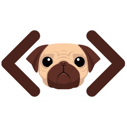

# 🐾 Pug Garden Minesweeper

Welcome to **Pug Garden Minesweeper**! A classic Minesweeper game with a whimsical twist, inspired by pugs and gardens. Help our pug avoid the dangers hidden beneath the garden tiles.



## 🌟 Features

- **Customizable Game Grid**: Responsive and perfectly square grid for a smooth gameplay experience on all devices.
- **Smart Mine Placement**: Mines are placed after the first click to ensure the first tile clicked is always safe.
- **Flag Management**: Mark the tiles you suspect of containing a mine.
- **Integrated Timer**: Keep track of the elapsed time to improve your performance with each game.
- **Modern Design**: Clean user interface with soft colors and smooth transitions.

## 🚀 Getting Started

### Prerequisites

Make sure you have [Node.js](https://nodejs.org/) installed on your machine.

### Installation

1. Clone this repository:

    ```bash
    git clone https://github.com/yourusername/pug-garden-minesweeper.git
    cd pug-garden-minesweeper
    ```

2. Install dependencies:

    ```bash
    npm install
    ```

3. Start the server:

    ```bash
    node app.js
    ```

4. Open your browser and navigate to: [http://localhost:3000](http://localhost:3000)

## 🎮 How to Play

1. **Start the Game**: Click on a tile to begin. The first tile clicked is always safe.
2. **Mark a Tile**: Right-click on a tile to flag it.
3. **Reveal a Tile**: Click on an unmarked tile to reveal it. If the tile contains a mine, the game is over.
4. **Win the Game**: Reveal all the tiles that do not contain mines to win.

## 📂 Project Structure

- `public/`: Contains static files like CSS styles, images, and JavaScript scripts.
- `views/`: Pug (templates) files for rendering HTML dynamically.
- `app.js`: Main entry point of the Node.js application.
- `script.js`: Main game logic, handling clicks, mines, and the timer.

## 🛠️ Technologies Used

- **Node.js**: Server to handle requests and serve the application.
- **Express**: Minimalist framework for Node.js.
- **Pug**: Template engine to dynamically generate HTML.
- **CSS Grid**: Used to build a responsive grid.

## 🤝 Contributing

Contributions are welcome! Whether it's bug fixes, new features, or improvements, feel free to make a pull request. Here’s how you can contribute:

1. **Fork the repository**.
2. **Create a new branch** (`git checkout -b feature-name`).
3. **Commit your changes** (`git commit -m 'Add some feature'`).
4. **Push to the branch** (`git push origin feature-name`).
5. **Open a pull request**.

Please make sure to update tests as appropriate.

## 🗨️ Community

Join the conversation! We’re excited to hear your feedback and ideas:

- **Issues**: Found a bug? Have a feature request? [Open an issue](https://github.com/yourusername/pug-garden-minesweeper/issues).
- **Discussions**: Share your thoughts or ask questions in our [Discussions forum](https://github.com/yourusername/pug-garden-minesweeper/discussions).

## 📜 License

This project is licensed under the MIT License. See the [LICENSE](LICENSE) file for more details.

---

**Have fun and help our pug safely navigate the garden! 🐾**

